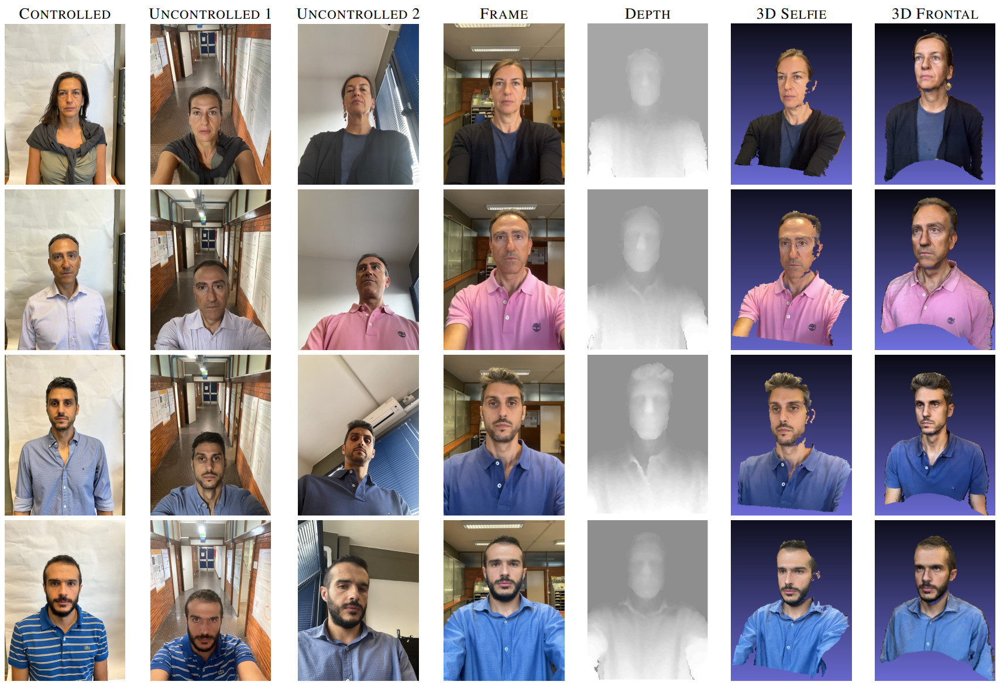

# Uniss-MDF

UNISS-MDF represents the first collection of 2D-3D data of human faces, acquired with a mobile device. About 80,000 samples of depth, images and videos are captured from a diverse set of more than 100 subjects, in both controlled and uncontrolled conditions.
It is a versatile resource for researchers and a wide range of applications. Notably, it is the sole 2D-3D facial dataset using data from a mobile device, including both 2D and 3D synchronized sequences acquired in controlled and uncontrolled conditions. 

Examples of data provided in UNISS-MDF. CONTROLLED: image acquired with a clean background and good light condition; UNCONTROLLED: selfie images without constraint; FRAME: image extracted from the video recording; DEPTH: depth image acquired by the mobile device; 3D SELFIE: 3D reconstruction from selfie scan; 3D FRONTAL: 3D reconstruction from a scan with frontal light.
